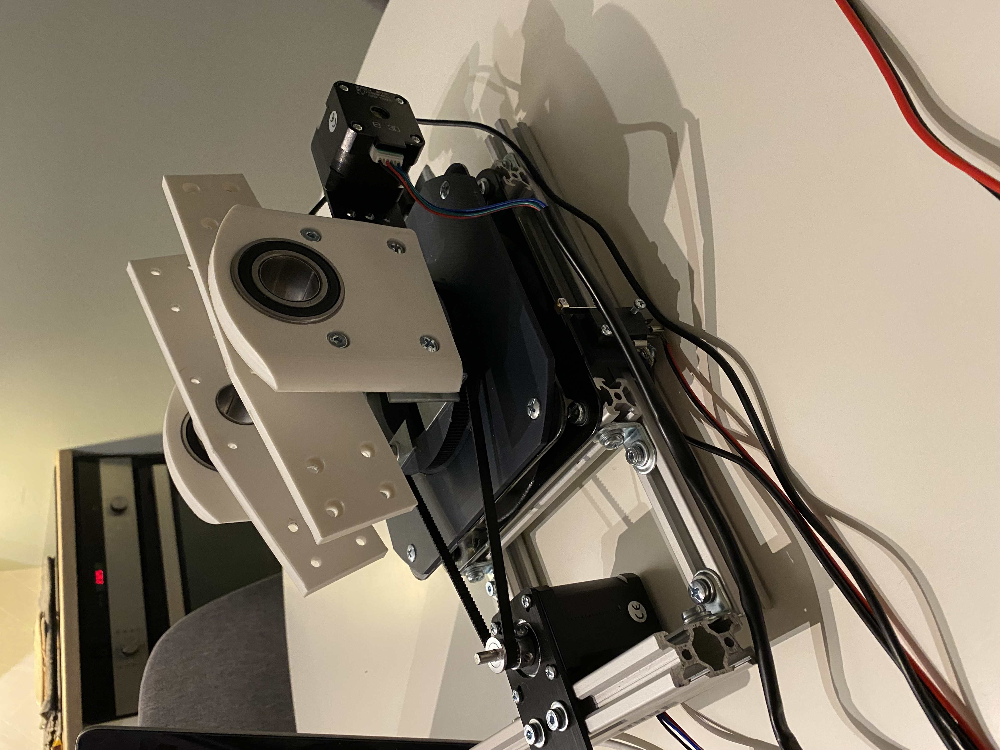
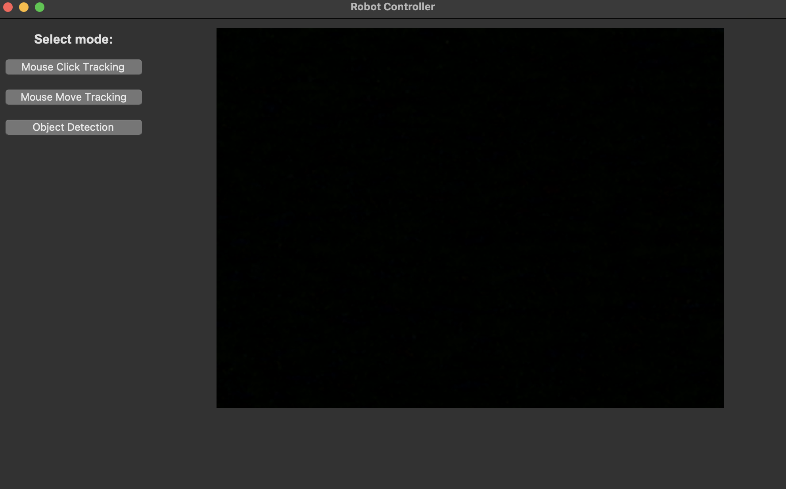
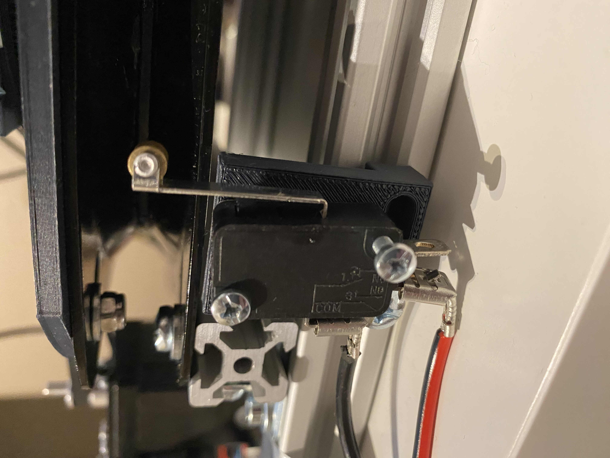

# Sentry Turret with Homing & GUI

This project demonstrates a stepper motor–driven “Sentry-turret”, with a laser module to simulates "shots" the Turret is build and designed by me with parts made in Fusion360 and 3D printed at home:

1. **X-axis homing** at startup and moving to a center position.
2. **Laser module** triggered by a limit switch pressed by i micro servo, to simulate a shot
3. The **Y-axis** starts physically at the bottom, then moves 1100 steps up for a “horizontal” start.  
4. A **Python GUI** (Tkinter) that shows the webcam feed and provides several “modes”:  
   - **Mouse Click** (click in the image => `(x,y)` to Arduino)  
   - **Mouse Movement** (move the mouse => `(x,y)` to Arduino)  
   - **Object Detection** (e.g. a “blue object” in the camera => `(cx, cy)` to Arduino)

The Arduino code receives \((x,y)\) and converts them into step positions for X and Y, with a limit switch on X and a manual starting position on Y.

---

## Contents

1. [Overview](#overview)  
2. [Hardware](#hardware)  
3. [Software & Files](#software--files)  
4. [Images](#images)

---

## Overview

- **Homing**:  
  - X moves in the positive direction until the switch is triggered. It then sets X=0 at that position, moves inward 1450 steps, and sets X=0 at the center.  
  - Y moves 1100 steps up from the bottom and sets Y=0 there.
 
- **Laser module**
  - To simulate a shot there is used a green laser module that is triggerd by a limit switch pressed by a micro servo that completes the circuit for 0.2 seconds.
  - this could be solved without the limit switch and servo but i wanted the clicking sound from the switch so that soulution was choosen.

- **GUI**:  
  - Displays the webcam feed in a Tkinter label.  
  - A “Mouse Click Tracking” button: clicking in the video => `(x,y)` is sent via serial to Arduino.  
  - A “Mouse Move Tracking” button: moving the mouse in the video => `(x,y)` is sent via serial.  
  - An “Object Detection” button: Colors (blue, yellow, Red and Greeen) and persons.

On the Arduino side, `(x,y)` from a 640×480 coordinate system typically translate to `(x - 320) * scaleX` and `(240 - y) * scaleY`, driving the stepper motors with AccelStepper.

---

## Hardware

1. **Arduino** (Uno)  
2. **2x Stepper drivers** (TMC2209)  
3. **Two stepper motors** (Nema 17)  
4. **Limit switch** on X (NO->pin7, COM->GND)  
5. **12/24V 10a power supply** for the stepper motors (depending on requirements)  
6. **Tight belt / pulley** for X and Y.
7. **Green laser module**
8. **micro servo**

## Software & Files

- **Arduino code**: Contains `homeXAxis()`, `parseCoordinates(...)` for `(x,y)`, etc.  
- **Python GUI** (Tkinter):  
  - Possibly `main_gui.py`, `mouse_click.py`, `mouse_move.py`, `object_detect.py`  
- **Dependencies**:  
  - `opencv-python` for camera usage,  
  - `pyserial` for serial communication,  
  - `Pillow`,  
  - `tkinter`.

## Images

- **Sentry Turret**

  
- **GUI**
  
- **Limit switch**
  

## Demos

 **Click to follow**

 **follow mouse**

 **Object Detection**

 
